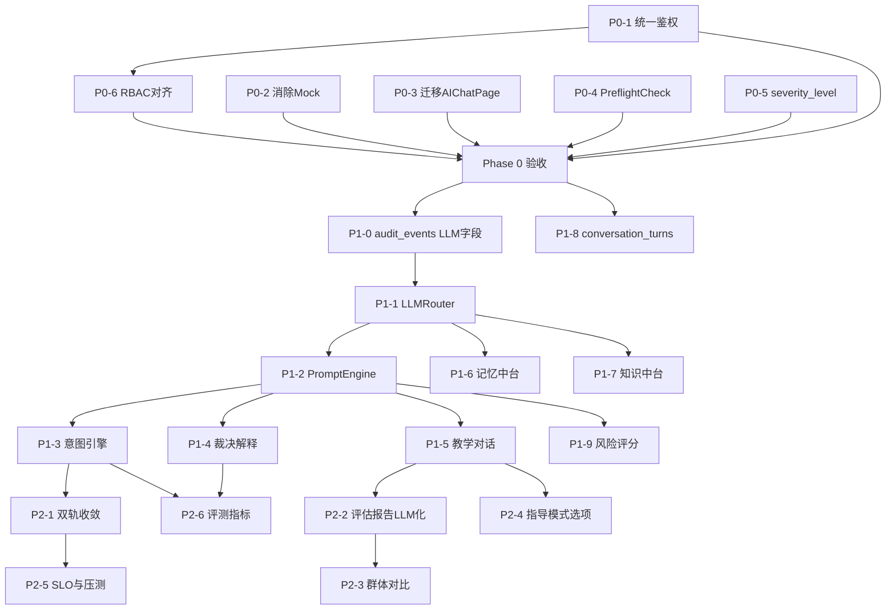

# R-MOS 智能体改造：差距分析 + 原子任务拆解

> 基线日期：2026-03-04 · 对照文档：R-MOS_Transformation_Plan_V1.0.md · 代码快照：当天工作区

---

## 第一部分：差距分析（Gap Analysis）

### 概览结论

| 维度 | 计划目标分 | 当前实际分 | 差距 | 改造项未开始数 |
|------|-----------|-----------|------|--------------|
| LLM 推理核心 | 8/10 | 0/10 | 🔴 严重 | 3/3 |
| 架构完整性 | 9/10 | 5/10 | 🟡 较高 | 4/4 |
| 教学层 | 9/10 | 6/10 | 🟡 中等 | 3/3 |
| 记忆与知识 | 8/10 | 4/10 | 🟡 较高 | 3/3 |
| 前端 & 安全 | 9/10 | 5/10 | 🟡 中等 | 2/2 |
| **合计** | — | — | — | **15/15 全部未开始** |

### 逐项差距详情

#### 推理层（L-01 ~ L-03）

| 编号 | 计划要求 | 当前代码状态 | 差距 |
|------|---------|-------------|------|
| L-01 | LLMRouter 统一入口，Provider 切换 | `requirements.txt` 无 openai/anthropic/langchain；代码搜索无任何 LLM SDK 调用 | 🔴 完全缺失 |
| L-02 | LLM 意图理解引擎 | `orchestrator_v2.py` 用关键词+规则 dispatch | 🔴 完全缺失 |
| L-03 | SOP 裁决 LLM 解释层（L2） | 裁决只输出 pass/fail，无解释/建议/引用 | 🔴 完全缺失 |

#### 架构层（A-01 ~ A-04）

| 编号 | 计划要求 | 当前代码状态 | 差距 |
|------|---------|-------------|------|
| A-01 | 收敛为 `/agent/execute` 单入口 | `/ai/commands`(26KB) + `/agent/v2/*`(44KB) 双轨并存 | 🟡 Phase 2 完成 |
| A-02 | `/agent/*` 统一 `require_permission` | [agent.py](file:///Users/xuhehong/Desktop/r-mos/r-mos-backend/app/api/v1/endpoints/agent.py) 68 个端点，**零个**含 `require_permission` | 🔴 完全缺失 |
| A-03 | AIChatPage 迁移至新入口 | [agent.ts](file:///Users/xuhehong/Desktop/r-mos/r-mos-frontend/src/api/agent.ts):78 仍调用 `/agent/request`（deprecated） | 🔴 未迁移 |
| A-04 | PreflightCheck 前置检查服务 | 代码搜索无 `PreflightCheck` 相关类/函数 | 🔴 完全缺失 |

#### 教学层（T-01 ~ T-03）

| 编号 | 计划要求 | 当前代码状态 | 差距 |
|------|---------|-------------|------|
| T-01 | `sop_steps.severity_level` 字段 | [sop.py](file:///Users/xuhehong/Desktop/r-mos/r-mos-backend/app/models/sop.py) `SOPStep` 无 `severity_level` 列；仅有 `is_critical` 布尔 | 🔴 缺失 |
| T-02 | 教学评估报告 LLM 化 | 仅 pass/fail 列表，无叙述性报告 | 🔴 缺失（依赖 L-01） |
| T-03 | 匿名群体对比 + SOP 质量反馈 | 无对比功能，无质量工单自动创建 | 🔴 缺失 |

#### 记忆与知识层（M-01 ~ M-03）

| 编号 | 计划要求 | 当前代码状态 | 差距 |
|------|---------|-------------|------|
| M-01 | 三层记忆中台（Redis+PG+pgvector） | `services/memory/` 目录为空（仅 `__pycache__`）；`belief_state.py` 全 in-memory | 🔴 完全缺失 |
| M-02 | pgvector embedding 知识中台 | [knowledge_chunk.py](file:///Users/xuhehong/Desktop/r-mos/r-mos-backend/app/models/knowledge_chunk.py):25 有 `embedding = Column(JSON)`，但类型为 JSON 非 `VECTOR(1536)` | 🟡 部分（需改为 pgvector） |
| M-03 | `conversation_turns` 表 | 搜索无结果；对话记录混存于 `audit_events` | 🔴 完全缺失 |

#### 前端 & 安全（F-01 ~ F-02）

| 编号 | 计划要求 | 当前代码状态 | 差距 |
|------|---------|-------------|------|
| F-01 | 4 页面消除 Mock | `ReplayPage` 纯 mock；`ApprovalQueuePage` 纯 mock；`AcceptanceDashboardPage` fallback mock；`IncidentListPage` fallback mock | 🔴 4/4 页面含 mock |
| F-02 | LLM 动态风险评分 | `policy_matrix.py` 仅规则/阈值硬编码 | 🔴 完全缺失（依赖 L-01） |

#### 数据模型变更需求

| 表 | 变更类型 | 当前状态 | 待做 |
|----|---------|---------|------|
| `sop_steps` | ALTER | 无 `severity_level` | 需新增字段 + Alembic 迁移 |
| `ai_knowledge_chunks` | ALTER | `embedding` 为 JSON | 需改为 pgvector `VECTOR(1536)` |
| `conversation_turns` | CREATE | 不存在 | 需新建表 + Alembic 迁移 |
| `audit_events` | ALTER | 无 LLM 字段 | 需新增 `prompt_hash/response_hash/provider/model/tokens_in/tokens_out` |
| `belief_state_records` | USE | 表已存在 | 需接入 agent 主链路 |

---

## 第二部分：原子任务拆解

> 每个原子任务设计为 **1-4 小时**可完成，含明确的文件路径、操作描述和验收条件。

---

### Phase 0：基础清理（第 1-2 周，共 24 个原子任务）

---

#### P0-1 统一 /agent/* 鉴权（6 个原子任务）

| # | 原子任务 | 操作 | 涉及文件 | 验收条件 |
|---|---------|------|---------|---------|
| 0-1-1 | 梳理 agent.py 全部端点清单 | 列出所有 68 个路由函数及其 HTTP 方法/路径，标注当前是否有鉴权 | `agent.py` | 产出端点权限矩阵文档 |
| 0-1-2 | 定义 agent 端点权限键映射 | 为每个端点分配 permission_key（如 `agent:execute`、`agent:trace:read`） | `agent.py` + 权限矩阵文档 | 权限键覆盖 100% 端点 |
| 0-1-3 | 给 agent.py 只读端点批量注入 `require_permission` | 对 GET 类只读端点（trace/metrics/status 等）添加 `Depends(require_permission("agent:read"))` | `agent.py` | 无 token 请求返回 401 |
| 0-1-4 | 给 agent.py 写入端点注入 `require_permission` | 对 POST/PUT/DELETE 端点添加对应 permission 依赖 | `agent.py` | role 不符返回 403 |
| 0-1-5 | 编写鉴权单元测试 | 为每个端点编写至少一个无 token → 401 + 无权限 → 403 的测试用例 | `tests/unit/test_agent_authz.py`（新建） | 测试全部 PASS |
| 0-1-6 | 更新前端权限矩阵 | 前端 `rolePermissions` 新增 agent 相关权限键，与后端一致 | 前端权限配置文件 | 前后端权限键一一对应 |

---

#### P0-2 消除 4 个关键 Mock（8 个原子任务）

| # | 原子任务 | 操作 | 涉及文件 | 验收条件 |
|---|---------|------|---------|---------|
| 0-2-1 | ReplayPage：确认后端 replay API | 核实 `/agent/v2/trace/{trace_id}/events` 真实返回数据结构 | 后端 `agent.py` replay 端点 | curl 测试返回真实数据 |
| 0-2-2 | ReplayPage：替换 mock 为真实 API 调用 | 删除 L59-131 的 `mockTrace`，调用真实 trace API | `ReplayPage.tsx` | 页面展示 DB 真实数据 |
| 0-2-3 | ApprovalQueuePage：对接真实审批 API | 将 L51-80 mock pending 和 L92-122 mock history 替换为调用 `/approvals/queue` 和 `/approvals/history` | `ApprovalQueuePage.tsx` | 待审批列表反映 DB 状态 |
| 0-2-4 | ApprovalQueuePage：实现审批/拒绝真实调用 | L138/L152 的 mock API call 替换为真实 POST | `ApprovalQueuePage.tsx` | 操作后 DB 状态变更 |
| 0-2-5 | AcceptanceDashboardPage：移除 fallback mock | 删除 L76-137 的 catch fallback mock，API 失败显示错误状态组件 | `AcceptanceDashboardPage.tsx` | API 失败时显示错误提示 |
| 0-2-6 | IncidentListPage：移除 fallback mock | 删除 L10-77 的 `mockIncidents` 及 fallback 逻辑，API 失败显示错误 | `IncidentListPage.tsx` | 不再显示 "当前使用本地 mock 数据" |
| 0-2-7 | 确认后端 API 对应端点均正常工作 | 用 httpx 或 curl 逐一测试 4 页面依赖的后端 API | 各后端端点 | 所有端点返回预期格式 |
| 0-2-8 | 前端 4 页面联调回归测试 | 启动前后端，浏览器遍历 4 个页面，确保无 mock 残留 | 浏览器测试 | 4 页面数据均来自 DB |

---

#### P0-3 迁移 AIChatPage（2 个原子任务）

| # | 原子任务 | 操作 | 涉及文件 | 验收条件 |
|---|---------|------|---------|---------|
| 0-3-1 | 修改前端 API 调用路径 | 将 `agent.ts:78` 的 `/agent/request` 改为 `/agent/v2/request`；适配请求/响应格式差异 | `src/api/agent.ts` + `AIChatPage.tsx` | 旧 `/agent/request` 调用在代码中清零 |
| 0-3-2 | 功能回归测试 | 打开 AIChatPage，发送测试消息，验证对话正常 | 浏览器测试 | 对话功能正常 |

---

#### P0-4 实现 PreflightCheck 服务（4 个原子任务）

| # | 原子任务 | 操作 | 涉及文件 | 验收条件 |
|---|---------|------|---------|---------|
| 0-4-1 | 定义 PreflightCheck 接口与数据结构 | 创建 `CheckResult`（status: PASS/WARN/BLOCK, message）；定义三个检查器的抽象基类 | `services/preflight_check.py`（新建） | 接口定义清晰 |
| 0-4-2 | 实现三个检查器 | `QualificationChecker`（学员资质）/ `DeviceLockChecker`（设备锁定状态）/ `ToolAvailabilityChecker`（工具可用性） | `services/preflight_check.py` | 每个检查器含正常/WARN/BLOCK 逻辑 |
| 0-4-3 | 集成到 POST /tasks 创建流程 | 在 `task_service.py` 的任务创建方法中调用 PreflightCheck；BLOCK 结果阻断创建并返回原因 | `task_service.py` + `tasks.py` | BLOCK 场景返回 400 + 原因 |
| 0-4-4 | 编写单元测试 | 3 个检查器 × 3 个场景（正常/WARN/BLOCK）= 9 个测试用例 | `tests/unit/test_preflight_check.py`（新建） | 9 个用例全部 PASS |

---

#### P0-5 SOP 步骤 severity_level 字段（2 个原子任务）

| # | 原子任务 | 操作 | 涉及文件 | 验收条件 |
|---|---------|------|---------|---------|
| 0-5-1 | 新增字段 + Alembic 迁移 | `SOPStep` 新增 `severity_level = Column(String(20), default="WARN")`；生成并执行 Alembic 迁移脚本 | `models/sop.py` + `alembic/versions/xxx.py` | 迁移执行成功；现有数据默认 WARN |
| 0-5-2 | 裁决服务读取 severity 并分级响应 | 修改裁决/评分服务，根据 severity_level 触发不同响应链；SAFETY_HALT 自动通知并锁定 | `scoring_service.py` / `task_service.py` | 不同 severity 触发对应行为 |

---

#### P0-6 前后端 RBAC 对齐（2 个原子任务）

| # | 原子任务 | 操作 | 涉及文件 | 验收条件 |
|---|---------|------|---------|---------|
| 0-6-1 | 梳理并对齐角色权限定义 | 对比后端 `rbac.py` 角色定义与前端 `rolePermissions`，统一角色名和权限键 | `models/rbac.py` + 前端权限文件 | 产出角色-权限映射对照表 |
| 0-6-2 | 移除前端硬编码 admin 判断 | 替换前端中的 `if role === 'admin'` 为基于权限键的判断 | 前端多处组件 | 管理页面鉴权经由后端，非仅菜单隐藏 |

---

### Phase 1：LLM 接入（第 3-6 周，共 38 个原子任务）

---

#### P1-1 LLMRouter 服务（5 个原子任务）

| # | 原子任务 | 操作 | 涉及文件 | 验收条件 |
|---|---------|------|---------|---------|
| 1-1-1 | 添加 LLM SDK 依赖 | `requirements.txt` 添加 `openai>=1.0`、`anthropic`（可选）、`httpx` | `requirements.txt` | `pip install` 成功 |
| 1-1-2 | 创建 LLMRouter 核心类 | 统一接口 `async def chat(messages, tools, model, provider) -> LLMResponse`；支持 OpenAI/Anthropic/Ollama 三种 Provider | `services/llm/router.py`（新建） | 调用 OpenAI API 返回正确结果 |
| 1-1-3 | 实现审计写入中间件 | 每次 LLM 调用自动写入 `audit_events`（prompt_hash / response_hash / provider / model / tokens_in / tokens_out） | `services/llm/router.py` | 调用后 DB 有审计记录 |
| 1-1-4 | 实现 fallback 降级机制 | LLM 调用失败时自动 fallback 到规则模式；记录降级事件 | `services/llm/router.py` | LLM 不可用时系统不崩溃 |
| 1-1-5 | 编写集成测试 | 测试 Provider 切换、审计写入、fallback 降级 | `tests/unit/test_llm_router.py`（新建） | 测试全部 PASS |

---

#### P1-2 PromptTemplateEngine（4 个原子任务）

| # | 原子任务 | 操作 | 涉及文件 | 验收条件 |
|---|---------|------|---------|---------|
| 1-2-1 | 定义模板区块数据结构 | SystemPrompt / ContextBlock / KnowledgeBlock / ToolBlock / OutputConstraint 五个 Pydantic 模型 | `services/llm/prompts.py`（新建） | 数据结构完整 |
| 1-2-2 | 实现模板渲染引擎 | 将各区块组装为完整 messages 列表；支持 JSON 输出约束 | `services/llm/prompts.py` | 渲染输出合法 messages |
| 1-2-3 | 创建 R-MOS 系统提示模板 | 编写维保教学智能体的角色/领域/安全规则/输出格式模板 | `services/llm/templates/`（新建目录） | 模板可被引擎加载 |
| 1-2-4 | 编写单元测试 | 测试模板渲染、JSON 约束、异常输入处理 | `tests/unit/test_prompt_engine.py`（新建） | JSON 解析成功率 >98% |

---

#### P1-3 意图理解引擎（5 个原子任务）

| # | 原子任务 | 操作 | 涉及文件 | 验收条件 |
|---|---------|------|---------|---------|
| 1-3-1 | 定义 IntentResult 数据结构 | `{ scene, entity, action, confidence, raw_text }` Pydantic 模型 | `services/intent/engine.py`（新建） | 结构完整 |
| 1-3-2 | 实现 LLM 意图识别核心 | 调用 LLMRouter，输入用户文本 + 上下文，输出结构化 intent | `services/intent/engine.py` | 返回合法 IntentResult |
| 1-3-3 | 实现低置信度澄清逻辑 | confidence < 0.6 时返回澄清请求而非执行 | `services/intent/engine.py` | 模糊输入触发澄清 |
| 1-3-4 | 替换 orchestrator_v2 的 dispatch 逻辑 | 将关键词匹配替换为 IntentEngine 调用 | `orchestrator_v2.py` | 请求通过 LLM 理解意图 |
| 1-3-5 | 编写评测脚本 + 100 条标注数据 | 创建意图标注数据集 + 准确率评测脚本 | `tests/eval/intent_accuracy.py`（新建） | 准确率 ≥ 85% |

---

#### P1-4 SOP 裁决 LLM 解释层（4 个原子任务）

| # | 原子任务 | 操作 | 涉及文件 | 验收条件 |
|---|---------|------|---------|---------|
| 1-4-1 | 定义裁决三元组数据结构 | `VerdictExplanation { reason, suggestions, citations: [ref_id] }` | `services/sop/verdict_enhancer.py`（新建） | 结构完整 |
| 1-4-2 | 实现 L2 LLM 解释生成 | L1 规则判断后，LLM 生成三元组；知识检索注入上下文 | `services/sop/verdict_enhancer.py` | L2 输出包含原因+建议+引用 |
| 1-4-3 | 集成到裁决服务主链路 | `scoring_service.py` 裁决后调用 VerdictEnhancer | `scoring_service.py` | 裁决结果含 LLM 解释 |
| 1-4-4 | 编写一致性测试 | 200 步骤对比 L1 判断与 L2 解释一致率 | `tests/eval/verdict_consistency.py`（新建） | 一致率 ≥ 90% |

---

#### P1-5 教学对话引擎（4 个原子任务）

| # | 原子任务 | 操作 | 涉及文件 | 验收条件 |
|---|---------|------|---------|---------|
| 1-5-1 | 创建 TeachingChatEngine 服务 | 输入：学员历史 + 当前步骤 + 3D 状态；输出：个性化指导文本 | `services/teaching/chat_engine.py`（新建） | 返回有意义的指导 |
| 1-5-2 | 实现三种指导模式 | AI 全程指导 / 按需指导 / 静默模式；模式通过参数控制 | `services/teaching/chat_engine.py` | 三种模式行为不同 |
| 1-5-3 | 对接前端对话界面 | 前端教学页面集成对话组件，调用教学对话 API | 前端相关页面 | 界面可发送/接收教学对话 |
| 1-5-4 | 编写单元测试 | 测试三种模式输出差异、异常输入处理 | `tests/unit/test_teaching_chat.py`（新建） | 测试 PASS |

---

#### P1-6 三层记忆中台（5 个原子任务）

| # | 原子任务 | 操作 | 涉及文件 | 验收条件 |
|---|---------|------|---------|---------|
| 1-6-1 | 添加 Redis 依赖 + 连接配置 | `requirements.txt` 添加 `redis[hiredis]`；创建 Redis 连接工厂 | `requirements.txt` + `core/redis.py`（新建） | Redis 连接可用 |
| 1-6-2 | 实现短期记忆层（Redis） | TTL 30min 的会话级记忆读写；按 session_id 索引 | `services/memory/short_term.py`（新建） | 写入后可读取；30min 后过期 |
| 1-6-3 | 实现长期记忆层（PostgreSQL） | 封装 `belief_state_records` + `decision_records` 的统一读写 | `services/memory/long_term.py`（新建） | 进程重启后数据可读 |
| 1-6-4 | 创建 MemoryHub 统一接口 | `MemoryHub.read(session_id)` 先查 Redis 再查 PG；`write()` 同时写两层 | `services/memory/hub.py`（新建） | 统一接口可用 |
| 1-6-5 | 接入 Agent 主链路 | 在 agent 请求处理链中添加 MemoryFetch + MemoryWrite 步骤 | `agent_service.py` / `orchestrator_v2.py` | 每次调用自动读写记忆 |

---

#### P1-7 知识中台统一（5 个原子任务）

| # | 原子任务 | 操作 | 涉及文件 | 验收条件 |
|---|---------|------|---------|---------|
| 1-7-1 | 启用 pgvector + 修改 embedding 字段类型 | PG 启用 `vector` 扩展；`embedding` 从 JSON 改为 `VECTOR(1536)`；Alembic 迁移 | `knowledge_chunk.py` + 迁移脚本 | 迁移成功 |
| 1-7-2 | 实现 Embedding 生成服务 | 调用 OpenAI `text-embedding-3-small` 生成 embedding | `services/knowledge/embedding.py`（新建） | 输入文本输出 1536 维向量 |
| 1-7-3 | 治理知识审核通过自动 embedding | `knowledge_governance.py` 审核通过回调触发 embedding 写入 chunk 表 | `knowledge_governance.py` | 审核后 chunk 有 embedding |
| 1-7-4 | 实现混合检索 API | 关键词召回 + 向量语义召回 + 简单重排序 | `services/knowledge/hub.py`（新建） | 检索返回 top-k 相关 chunk |
| 1-7-5 | 编写检索 F1 评测 | 标注测试集 + F1 评测脚本 | `tests/eval/knowledge_retrieval.py`（新建） | F1 ≥ 0.80 |

---

#### P1-8 conversation_turns 表（3 个原子任务）

| # | 原子任务 | 操作 | 涉及文件 | 验收条件 |
|---|---------|------|---------|---------|
| 1-8-1 | 创建模型 + Alembic 迁移 | 新建 `ConversationTurn` 模型（id / session_id / task_id / step_id / role / content / created_at）；生成迁移脚本 | `models/conversation.py`（新建）+ 迁移脚本 | 表创建成功 |
| 1-8-2 | 创建 CRUD 服务 | 对话写入 + 按 task_id/session_id 查询 API | `services/conversation_service.py`（新建）+ 路由端点 | CRUD 测试 PASS |
| 1-8-3 | 对话写入从 audit_events 切换到 conversation_turns | 修改对话记录写入逻辑，新对话写 conversation_turns | 相关 service 文件 | audit_events 中无新对话类事件 |

---

#### P1-9 LLM 动态风险评分（3 个原子任务）

| # | 原子任务 | 操作 | 涉及文件 | 验收条件 |
|---|---------|------|---------|---------|
| 1-9-1 | 创建 LLMRiskScorer | 输入：学员历史/设备状态/步骤复杂度；输出：0-100 风险分 | `services/policy/risk_scorer.py`（新建） | 返回合理风险分 |
| 1-9-2 | 集成到 policy_matrix | `policy_matrix.evaluate` 调用 LLMRiskScorer；固定规则作兜底 | `policy_matrix.py` | 风险分超阈值触发审批 |
| 1-9-3 | 编写单元测试 | 测试风险分分布、阈值触发审批、降级到规则兜底 | `tests/unit/test_risk_scorer.py`（新建） | 测试 PASS |

---

#### P1-0 audit_events 表 LLM 字段扩展（1 个原子任务，Phase 1 前置）

| # | 原子任务 | 操作 | 涉及文件 | 验收条件 |
|---|---------|------|---------|---------|
| 1-0-1 | 新增 6 个 LLM 审计字段 + Alembic 迁移 | `AuditEvent` 新增 `prompt_hash / response_hash / provider / model / tokens_in / tokens_out` | `models/audit_event.py` + 迁移脚本 | 迁移成功；旧数据字段为 NULL |

---

### Phase 2：深度强化（第 7-12 周，共 25 个原子任务）

---

#### P2-1 双轨 Agent 完全收敛（6 个原子任务）

| # | 原子任务 | 操作 | 涉及文件 | 验收条件 |
|---|---------|------|---------|---------|
| 2-1-1 | 设计 `/agent/execute` 统一端点 | 定义请求/响应 schema，兼容 A/B 两套体系的功能 | 设计文档 | Schema 评审通过 |
| 2-1-2 | 实现 `/agent/execute` 端点 | 新建路由 + 服务，整合 orchestrator_v2 和 ai_commands 的核心逻辑 | `agent.py` + 新服务文件 | 新端点可处理所有请求类型 |
| 2-1-3 | 前端统一 API 封装 | 创建统一的 `agentExecute()` 函数，所有页面迁移到新封装 | `src/api/agent.ts` | 前端不再直接调用旧端点 |
| 2-1-4 | 旧端点标记 deprecated | `/ai/commands` + `/agent/v2/*` 添加 deprecated 响应头 + 日志记录调用量 | `ai_commands.py` + `agent.py` | deprecated 调用有日志 |
| 2-1-5 | 编写 E2E 测试 | 新主链路端到端测试覆盖所有核心场景 | `tests/e2e/test_agent_execute.py`（新建） | E2E 测试 PASS |
| 2-1-6 | 下线旧端点 | 确认旧端点调用量归零后移除代码 | `ai_commands.py` + `agent.py` | 旧代码清除 |

---

#### P2-2 教学评估报告 LLM 化（4 个原子任务）

| # | 原子任务 | 操作 | 涉及文件 | 验收条件 |
|---|---------|------|---------|---------|
| 2-2-1 | 定义 LLM 评估报告数据结构 | 报告含原因分析、个性化建议、下一步学习计划 | Pydantic schema | 结构完整 |
| 2-2-2 | 实现 LLM 报告生成服务 | 任务完成后收集全程证据链，LLM 生成叙述性报告 | `services/teaching/report_generator.py`（新建） | 生成可读报告 |
| 2-2-3 | 报告写入 evidence_bundles + 前端展示 | 报告存储并在前端 ReportPage 展示 | `evidence_service.py` + `ReportPage.tsx` | 前端可查看 LLM 报告 |
| 2-2-4 | 用户可读性评测 | 准备评测问卷，收集反馈 | 评测脚本/问卷 | 可读性评分 ≥ 4/5 |

---

#### P2-3 匿名群体对比 + SOP 质量反馈（5 个原子任务）

| # | 原子任务 | 操作 | 涉及文件 | 验收条件 |
|---|---------|------|---------|---------|
| 2-3-1 | 设计匿名统计 API | 按学员级别聚合统计（脱敏），返回同级均值/分位数 | 设计文档 | 隐私保护规则明确 |
| 2-3-2 | 实现群体统计服务 | 基于 assignment_attempts 计算同级别学员匿名指标 | `services/teaching/group_stats.py`（新建） | 返回匿名统计数据 |
| 2-3-3 | 评估报告添加「同伴对比」维度 | 报告生成时注入群体统计上下文 | `report_generator.py` | 报告含对比部分 |
| 2-3-4 | SOP 质量反馈：失败率监控 + 自动工单 | 某步骤失败率 >40% 时自动创建 SOP 审核工单 | `services/sop/quality_monitor.py`（新建） | 工单自动创建测试通过 |
| 2-3-5 | 隐私保护审核 | 确保群体数据不可溯源到个人；最小组大小限制 | 审核文档 | 审核通过 |

---

#### P2-4 前端 AI 指导模式选项（4 个原子任务）

| # | 原子任务 | 操作 | 涉及文件 | 验收条件 |
|---|---------|------|---------|---------|
| 2-4-1 | 后端：用户配置存储 | 新增用户偏好设置 API（指导模式偏好） | `services/user_preference.py`（新建）+ 路由 | 设置可持久化 |
| 2-4-2 | 前端：任务启动模式选择 UI | 任务创建/启动时弹出模式选择（全程/按需/静默） | 前端 TaskExecutionPage / 组件 | UI 可切换三种模式 |
| 2-4-3 | 前端：模式偏好持久化 | 选择后写入用户配置，下次自动带出 | 前端 store / API 调用 | 跨会话保持偏好 |
| 2-4-4 | 集成测试 | 三种模式切换 + 持久化 + 对话引擎行为差异验证 | 浏览器测试 | 全部功能正常 |

---

#### P2-5 生产 SLO 与压测门禁（3 个原子任务）

| # | 原子任务 | 操作 | 涉及文件 | 验收条件 |
|---|---------|------|---------|---------|
| 2-5-1 | 定义 SLO 指标 + 告警规则 | P50<1s, P95<5s, 可用率>99.5%；告警阈值配置 | 配置文件 / 文档 | SLO 文档输出 |
| 2-5-2 | 编写压测脚本 | 使用 Locust/k6 编写 100 并发 30 分钟压测场景 | `tests/load/locustfile.py`（新建） | 脚本可运行 |
| 2-5-3 | 执行压测 + 形成门禁检查单 | 运行压测，收集结果，形成上线检查单 | 压测报告 | P95<5s，错误率<0.1% |

---

#### P2-6 LLM 评测指标体系（3 个原子任务）

| # | 原子任务 | 操作 | 涉及文件 | 验收条件 |
|---|---------|------|---------|---------|
| 2-6-1 | 定义五项评测指标 | 意图准确率 / 裁决一致率 / 知识引用精度 / P95延迟 / Token成本 | 评测规范文档 | 五项指标定义明确 |
| 2-6-2 | 实现自动化评测脚本 | 各指标的自动化计算脚本，从 DB 和 LLM 日志采集数据 | `tests/eval/llm_metrics.py`（新建） | 脚本可运行并输出报告 |
| 2-6-3 | 构建评测仪表板 | 前端页面展示五项指标趋势，支持周报生成 | 前端仪表板页面 | 仪表板可查看 |

---

## 第三部分：依赖关系与执行顺序

### 依赖关系图

### 推荐执行顺序

| 批次 | 任务 | 可并行 | 预估工时 |
|------|------|-------|---------|
| **Batch 1** | P0-1 鉴权 + P0-2 去Mock + P0-3 迁移Chat + P0-5 severity | ✅ 4 任务并行 | 3 天 |
| **Batch 2** | P0-4 PreflightCheck + P0-6 RBAC对齐 | ✅ 2 任务并行 | 4 天 |
| **Batch 3** | P1-0 audit字段 + P1-8 conversation_turns | ✅ 2 任务并行 | 2 天 |
| **Batch 4** | P1-1 LLMRouter | 串行 | 4 天 |
| **Batch 5** | P1-2 PromptEngine | 串行 | 3 天 |
| **Batch 6** | P1-3 意图引擎 + P1-4 裁决解释 + P1-6 记忆中台 + P1-7 知识中台 | ✅ 4 任务并行 | 5 天 |
| **Batch 7** | P1-5 教学对话 + P1-9 风险评分 | ✅ 2 任务并行 | 5 天 |
| **Batch 8** | P2-1 双轨收敛 | 串行 | 6 天 |
| **Batch 9** | P2-2 评估报告 + P2-4 指导模式 + P2-6 评测指标 | ✅ 3 任务并行 | 5 天 |
| **Batch 10** | P2-3 群体对比 + P2-5 SLO压测 | ✅ 2 任务并行 | 5 天 |

---

## 第四部分：资源前置检查（阻塞项）

> [!CAUTION]
> 以下资源在 Phase 1 启动前必须到位，否则将阻塞开发。

| 资源 | 状态 | 阻塞哪些任务 | 所需行动 |
|------|------|-------------|---------|
| **OpenAI/Anthropic API Key** | ❌ 无 | P1-1 ~ P1-9 全部 | 申请 API 账号，配置环境变量 |
| **Redis 实例** | ❌ 无 | P1-6 记忆中台 | `docker run redis:7` 或云实例 |
| **pgvector 扩展** | ❌ 未启用 | P1-7 知识中台 | PostgreSQL 执行 `CREATE EXTENSION vector` |
| **100 条意图标注数据** | ❌ 无 | P1-3 评测 | 需人工标注维保领域意图样本 |
| **200 条裁决标注数据** | ❌ 无 | P1-4 评测 | 需人工标注步骤裁决对 |
