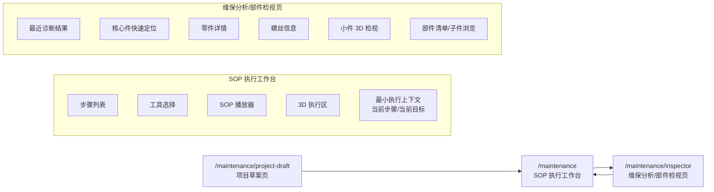

# 2026-03-12 SOP 工作台核查与拆页方案

## 1. 范围

- 页面路由：`/maintenance`
- 对照代码：
  - `r-mos-frontend/src/pages/SOPMaintenancePage.tsx`
  - `r-mos-frontend/src/components/Maintenance/SOPMaintenanceShell.tsx`
  - `r-mos-frontend/src/components/Maintenance/ToolSelector.tsx`
  - `r-mos-frontend/src/components/Maintenance/SOPPlayerAdjudicated.tsx`
  - `r-mos-frontend/src/components/Maintenance/ScrewInfo.tsx`
- 对照测试：
  - `r-mos-frontend/src/pages/__tests__/SOPMaintenancePage.test.tsx`
  - `r-mos-frontend/src/pages/__tests__/SOPMaintenancePage.dynamic.test.tsx`
  - `r-mos-frontend/src/components/Maintenance/__tests__/SOPMaintenanceShell.test.tsx`

## 2. 结论

当前 `SOP 工作台` 的核心执行链是可用的，但页面同时承载了两类任务：

1. 执行型任务：步骤推进、工具确认、3D 交互、播放器控制
2. 分析型任务：快速定位、诊断摘要、零件知识、螺丝知识、小件检视

这两类任务混在同一页，导致用户在执行 SOP 时被大量解释性信息打断。最合适的方向不是继续堆折叠区，而是拆成：

- `SOP 执行工作台`：专注执行
- `维保分析/部件检视页`：专注查看、定位、诊断和知识上下文

## 3. 按钮与功能核查清单

### 3.1 页面级与头部

| 区域 | 控件 | 结果 | 说明 |
| --- | --- | --- | --- |
| 页头 | `进入项目草案页` | 正常 | 实测可跳转到 `/maintenance/project-draft` |
| 页头 | `正常 / 爆炸图` 分段控制 | 正常 | `正常` 可回到总览；总览态点 `爆炸图` 会弹提示并阻止进入 |
| 页头 | `细节` 开关 | 正常 | 实测 checked 状态可切换 |
| 页头 | `教学/考试/维保` 模式下拉 | 部分验证 | 下拉可打开，切换会弹“重置进度”确认框；本轮未稳定复现非维保模式最终落态，需单独补一轮 |
| 页头 | 运行时模型资源按钮 | 本轮未触发 | 仅在从项目草案页带入 `runtimeManifest` 后出现，当前未导入运行时草案，未做交互验证 |

### 3.2 左侧执行区

| 区域 | 控件 | 结果 | 说明 |
| --- | --- | --- | --- |
| SOP 列表 | 30 个 SOP 按钮 | 正常 | 代码共享同一 `setLinkedSOPId` 路径；已实测代表项切换到 `左臂关节快速点检`，步骤和 3D 同步更新 |
| 爆炸图控制 | `收起` / `40%` / `完全展开` | 正常 | 总览态禁用；进入隔离态后可用 |
| 爆炸图控制 | `播放拆卸动画 / 停止拆卸动画` | 正常 | 实测按钮文案可切换，页面会出现拆卸步骤提示 |
| 子组件区 | 子组件按钮 | 正常 | 实测 `躯干` 按钮可响应 |
| 工具选择 | 工具卡片 | 正常 | 可选中当前工具；但实现是 clickable `div`，不是语义按钮 |
| 工具选择 | `放下工具` | 正常 | 实测可清空当前工具 |
| 播放器 | SOP 下拉 | 正常 | 实测可从“躯干外观与连接点检”切到“左臂关节快速点检” |
| 播放器 | `下一步` | 正常 | 已实测可推进到执行态或触发验证提示 |
| 播放器 | `上一步` | 条件正常 | 初始步骤禁用，符合预期 |
| 播放器 | `重载` | 本轮未单点 | 代码与现有测试存在，但本轮未单独触发 |

### 3.3 中央 3D 区

| 区域 | 控件 | 结果 | 说明 |
| --- | --- | --- | --- |
| 面包屑区 | `↩ 返回总览` | 正常 | 实测可退出隔离态并清空快速定位选择 |
| 面包屑区 | `同级：淡出 / 隐藏` | 已存在，未单点 | 代码具备切换路径，本轮未逐项点验 |
| 面包屑区 | `全屏` | 正常 | 进入/退出全屏可用 |
| 3D 联动 | SOP/快速定位/播放器联动 | 正常 | 代表项已验证，当前标题、步骤和 3D 面包屑会同步变化 |

### 3.4 右侧分析区

| 区域 | 控件 | 结果 | 说明 |
| --- | --- | --- | --- |
| 快速定位 | 核心件下拉 | 正常 | 实测可切到 `左前臂`，并同步进入隔离视图 |
| 诊断卡片 | `确认执行方案` | 假动作 | 当前仅前端 toast：`已确认执行方案，请按 SOP 步骤继续操作` |
| 诊断卡片 | `上报教师审核` | 假动作 | 当前仅前端 toast：`已上报教师审核` |
| 详情页签 | `零件 / 螺丝` | 正常 | 实测可切页；空态文案正常 |
| 零件详情 | `取消选中` | 正常 | 实测可清空右侧详情 |
| 螺丝详情 | 螺丝条目 | 条件正常 | 当前需先有零件/细件选择；空态表现正常 |

## 4. 当前页面最主要的问题

### 4.1 信息架构问题

`/maintenance` 现在同时放了：

- 顶部项目草案入口
- 左侧执行控制
- 中央 3D 操作
- 右侧诊断摘要
- 右侧零件/螺丝知识

这意味着用户在“执行步骤”时，视线会持续被“解释信息”和“上下文信息”分散。

### 4.2 业务完成度问题

诊断卡片的两个核心动作还不是真后端动作：

- `确认执行方案`
- `上报教师审核`

它们在 `SOPMaintenancePage.tsx` 里仍然是本地 `message.success/info`，不是正式提交。

### 4.3 可用性问题

`ToolSelector` 和 `ScrewInfo` 里的可点击项大量使用 `div + onClick`，这会带来：

- 键盘可达性差
- 自动化测试识别困难
- 交互语义不清晰

## 5. 推荐拆页方案

### 5.1 推荐方案

保留现有 `/maintenance/project-draft`，再把当前 `/maintenance` 拆成两条主路由：

- `/maintenance`
  - 名称：`SOP 执行工作台`
- `/maintenance/inspector`
  - 名称：`维保分析 / 部件检视页`

### 5.2 为什么不是继续在一页里折叠

继续加折叠块虽然改动最小，但不会消除根因：

- 用户还是在一个页面里同时处理“执行”和“分析”
- 页面首屏仍然很重
- 右侧区块仍然和中央执行区抢注意力

拆页之后，用户路径会更清楚：

- 执行时只看执行页
- 想看诊断、部件知识、螺丝信息时进入检视页

## 6. 拆页后的页面结构图

## 7. 模块迁移建议

### 7.1 保留在 `/maintenance`

- `SOPMaintenanceHeader`
  - 但顶部“项目草案入口”卡片建议移除，改成一个小型文本入口或次级按钮
- `SOPMaintenanceLeftRail`
  - 保留步骤列表、爆炸图控制、子组件按钮、工具选择、播放器
- 中央 `3D viewer`
- 与执行强相关的状态：
  - 当前步骤
  - 当前工具
  - 当前目标部位

### 7.2 迁移到 `/maintenance/inspector`

- 右侧 `核心件快速定位`
- `最近诊断结果`
- `维保详情`
  - 零件详情
  - 螺丝信息
  - 小件检视
  - 部件清单/子件列表

### 7.3 顶部草案入口的处理

当前顶部“项目草案入口”卡片本身已经说明，项目草案能力已迁到独立页面。  
所以继续把它放在 `/maintenance` 顶部意义不大，建议改成：

- 页头右上角次级按钮：`项目草案`
- 或执行页空态时再显示

## 8. 迁移步骤

### Phase 1: 先做低风险拆壳

状态：已完成（2026-03-12 首批实现）

1. 新增路由 `/maintenance/inspector`
2. 复制当前右侧栏为独立页面骨架
3. 保持状态来源不变，先共享已有 store/state

### Phase 2: 收紧执行页

状态：已完成第一步（2026-03-12 首批实现）

1. 从 `/maintenance` 移除：
   - 最近诊断结果
   - 核心件快速定位
   - 零件/螺丝详情
2. 顶部项目草案卡片改为小入口
3. 保留执行最小闭环

### Phase 3: 补真后端动作

状态：已完成（2026-03-12 第二批实现）

1. 把诊断卡片里的：
   - `确认执行方案`
   - `上报教师审核`
   接成真实接口
2. 把 inspector 页变成真实分析页，而不是只读壳

结果：
- inspector 页已复用 AI 工作台的 `runDiagnosisAction` 接口
- 最近诊断快照已补充 `traceId`，SOP 页可基于最近一次诊断轨迹提交动作
- 诊断动作提交时增加前端门禁，避免无 `traceId` 或重复提交时误触发

### Phase 4: 收尾优化

状态：已完成（2026-03-12 第二批实现）

1. 把 `ToolSelector`、`ScrewInfo` 的 clickable `div` 改成语义按钮
2. 补 `/maintenance/inspector` 页面测试
3. 补执行页和检视页之间的跳转入口

结果：
- `ToolSelector` 与 `ScrewInfo` 的主要可点击项已改为语义化 `button`
- 新增工具/螺丝面板测试，覆盖按钮语义与点击回调
- inspector 页测试已补到“诊断动作真实调用后端 API”

## 9. 我建议的实施顺序

1. 先拆出 `/maintenance/inspector`
2. 再精简 `/maintenance`
3. 然后把诊断区假动作接后端
4. 最后做按钮语义化和测试补齐

这个顺序的优点是：

- 风险最小
- 页面会先变清爽
- 不需要一开始就重写整套状态管理
