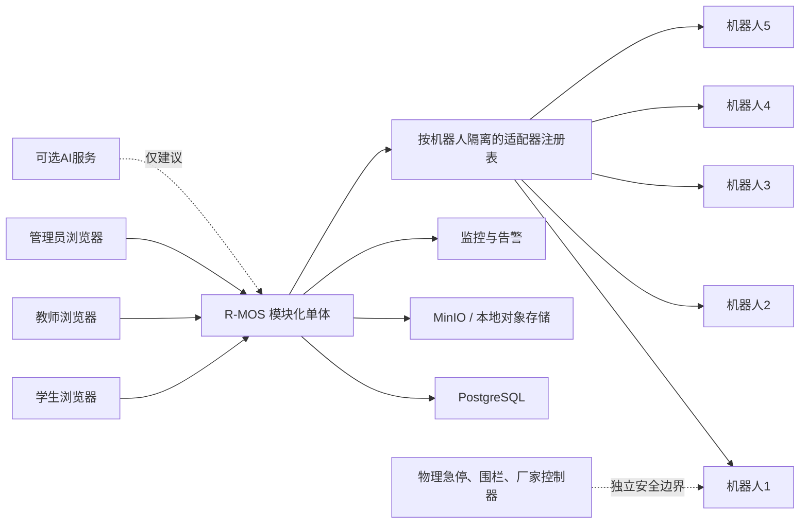

# R-MOS 单校五台真机完整交付优化实施计划

> **For Codex:** 实施本计划时必须使用 superpowers:executing-plans，按工作包逐项建立测试、实施、验证和提交记录；未经用户许可不得推送。

**Goal:** 在六个月内，把现有 R-MOS 从功能较多但边界分散的演示型系统，升级为可在一所学校私有部署、支持五台真机受控教学、能够正式验收和移交的完整项目。

**Architecture:** 保留现有 FastAPI、PostgreSQL、React、Three.js 和 Docker Compose 组成的模块化单体。先封闭权限与安全缺口，再统一教学、训练、证据、评分和报告链路，最后通过按机型适配器接入五台真机。真机动作必须来自预定义动作目录，必须由教师逐次确认，并受现场检查、厂家控制器和物理急停约束；AI只能提出建议。

**Tech Stack:** FastAPI、SQLAlchemy async、PostgreSQL 16、React 18、TypeScript、Vite、Three.js、MinIO、Nginx、Docker Compose；新增能力候选为 MCAP、OpenTelemetry、Prometheus，其他开源项目仅借鉴设计。

- **文档版本:** 0.1.0
- **状态:** Phase 5变更管理方案完成，等待用户确认冻结BASE-001；生产启用仍受真实演练门禁
- **最后更新:** 2026-08-10
- **适用范围:** 单校私有部署、1,000名学生、50名教师及管理员、5台真机、6个月交付

---

## 1. 项目目标与成功标准

### 1.1 一句话目标

为职业院校教师提供一套从课程设计、仿真训练、教师确认、真机受控动作、证据留存、评分到报告发布的完整教学平台。

### 1.2 当前事实基线

- 当前代码包含184个服务入口声明、116个后端测试文件、70个前端测试文件。
- 已有登录、学校与用户、机器人资料上传、3D展示、SOP、任务、训练、教学尝试、证据、诊断、评分、报告、审批和AI工作台等能力。
- 当前只有 MockRobotAdapter；Gazebo 和真实机器人分支会直接返回“未实现”。
- 当前机器人适配器是全局单实例，不能正确承载5台不同机器人。
- 当前 WebSocket 接收 robot_id 但不按机器人过滤，也没有服务端身份与订阅权限校验。
- 当前只有任务列表收敛了身份检查，任务详情、报告、事件及多组SOP、维保、故障、训练入口仍存在未统一保护的情况。
- 当前学生任务入口仍可直接接收 student_id，部分训练动作请求直接接收 teacher_id，存在“请求参数代替真实身份”的风险。
- 当前 AssignmentAttempt、Task、TaskExecution、TrainingSession 等多套链路并存，评分与报告可能读取不同来源。
- 审批页面已经存在，但未注册到正式前端路由。
- Docker Compose 仍带默认密码、开发密钥和 DEBUG=true，不可作为生产交付配置。
- 项目规则引用的验收章程、专项计划、检查清单和根开发日志已被归档或缺失，现行规则与仓库布局不一致。
- 正式后端测试环境要求使用 .venv，但当前 .venv 不存在；现有 r-mos-backend/venv 不得作为正式验收证据。
- 2026-08-10前端现测为62个测试文件通过，477项通过、2项跳过；生产构建通过。
- 前端构建仍提示部分文件超过500kB，其中Three.js和Ant Design相关文件最大约1.18MB，必须纳入3D页面15秒门禁和后续按测量结果拆分。

### 1.3 成功指标

| Metric_ID | 目标 | 测量方法与窗口 | 应急阈值 |
|---|---|---|---|
| M-01 | 5/5台机器人通过受控接入验收 | 每台执行接口、72小时只读稳定性、急停和受控动作测试 | 少于5台则不算完整交付 |
| M-02 | 教师黄金流程成功率不低于99% | 500次“布置到报告”端到端试验 | 低于98%停止验收 |
| M-03 | 成绩与报告一致率100% | 抽取1,000次训练，比较步骤、证据、分数和报告版本 | 出现1次不一致即阻断 |
| M-04 | 未登录和越权成功次数为0 | 每次发布对100%非公开入口执行四角色矩阵测试 | 覆盖率低于100%或出现1次严重越权即阻断 |
| M-05 | 未批准动作成功次数为0，动作审计完整率100% | 10,000次正常、重复、过期、伪造和越权动作测试 | 出现1次未批准动作或缺少1条关键审计即阻断 |
| M-06 | 5/5台机器人安全测试通过 | 按厂家要求执行急停、断网、超时、复位和回零测试 | 任一安全项失败即撤销该机受控资格 |
| M-07 | 普通请求 p95 小于400毫秒，p99小于1秒；遥测到页面 p95小于300毫秒 | 100并发、50请求/秒、100条遥测/秒，持续60分钟 | 错误率超过1%持续1分钟或普通请求p95超过3秒即停止发布 |
| M-08 | 教学可用率不低于99.5%，RTO不超过30分钟，RPO不超过15分钟 | 按月统计并每月执行一次恢复演练 | 单次恢复超过30分钟或数据丢失超过15分钟即停止扩班 |
| M-09 | 单场25名学生使用5台机器人，95%学生等待不超过10分钟 | 连续20场满员课堂演练 | 任一学生等待超过15分钟或连续2场p95超过10分钟即重新排课 |
| M-10 | 第14天完成5个机型选择，每台评分不低于80/100 | 使用本计划选型表逐项评分并留存证据 | 少于5台合格机型则立即重定范围和工期 |

---

## 2. 范围定义

### 2.1 本版本必须完成

| Req_ID | 必须能力 | 绑定指标 |
|---|---|---|
| R-01 | 所有非公开入口、对象、WebSocket和文件均执行服务端身份、角色、学校和资源归属检查；拒绝也留审计 | M-04、M-05 |
| R-02 | Assignment → Attempt → Task → Evidence → ScoreSnapshot → ReportRevision 形成唯一主链路 | M-02、M-03 |
| R-03 | 五台真机通过统一适配器、动作目录、教师逐次确认、现场检查和物理急停完成受控接入 | M-01、M-05、M-06、M-10 |
| R-04 | 每台机器人的遥测、3D模型、动作、证据和状态严格隔离，断网和超时不自动重发动作 | M-01、M-07 |
| R-05 | 提供可重复部署、备份恢复、运行监控、测试门禁、交付文档和验收证据包 | M-02、M-07、M-08 |

### 2.2 应当完成

- AI辅助SOP、故障解释、教案草稿和训练复盘，但关闭AI后核心流程仍可用8小时。AI备课效率只在5名教师完成20份教案、计时中位数不超过60分钟且p95不超过90分钟后才可对外承诺。
- 建立机器人数字档案，保存型号、序列号、固件、安全资料、动作目录、适配器版本和验收状态。
- 建立告警从产生、确认、处理、关闭到复盘的完整生命周期。
- 为教师提供班级、机器人、学生、步骤、风险和审批负载视图。
- 支持训练证据按时间轴回放和导出。

### 2.3 可以后续增加

- 教师可视化编排AI辅助流程。
- 训练数据集导出和匿名化工具。
- 更深入的仿真、碰撞检查和运动规划。
- 自定义大屏和移动端适配。

### 2.4 本版本明确不做

- AI直接控制真机。
- 学生自我批准真机动作。
- 未预定义的自由轨迹、开放式连续运动或自动重试动作。
- 多学校SaaS、跨校数据共享、车队调度和原生移动应用。
- 为追求形式而改成微服务、Kubernetes、Kafka或大型工作流平台。
- 整体嵌入Dify、ThingsBoard、OpenRemote、Open-RMF或Open MCT。

---

## 3. 用户故事与验收标准

### US-01 教师组织课堂

作为教师，我要发布训练、查看学生进度、确认真机动作并冻结成绩，以便在不绕过现场安全措施的前提下完成可追溯教学。

- AC-01：给定教师已登录且属于当前学校，当其查看本班任务时，只能看到本班学生；跨班和跨校请求返回404并留下真实资源编号的拒绝审计。测试 T-01。
- AC-02：给定学生提出预定义动作，当现场检查、机器人状态和教师确认全部有效时，系统在1秒内接受发送；批准后超过30秒必须重新检查和批准。测试 T-02。
- AC-03：给定机器人处于执行中，当第二个动作到达时，系统拒绝第二个动作并记录冲突；10,000次并发测试重复执行为0。测试 T-03。

### US-02 学生完成训练

作为学生，我要先仿真学习，再申请有限的真机动作，并看到与实际过程一致的成绩和报告。

- AC-04：给定学生完成一个步骤，当证据尚未满足评分规则时，不允许把训练标记为完成。测试 T-04。
- AC-05：给定一次训练已经完成，当教师冻结成绩并发布报告时，任务、证据、分数和报告必须引用同一个 attempt_id；1,000组记录一致率100%。测试 T-05。
- AC-06：给定学生访问其他学生的训练、证据或报告时，对外返回404，同时审计记录真实资源编号。测试 T-06。

### US-03 管理员接入机器人

作为管理员，我要完成资料导入、接口测试、安全测试和发布审批，以便只有合格机器人能够进入真机教学。

- AC-07：给定新机器人，当72小时只读运行稳定率不低于99.9%且安全项全部通过时，状态才可从“只读”进入“受控可用”。测试 T-07。
- AC-08：给定任何安全资料缺失、物理急停失败或适配器超过25人日仍不可用时，该机型不得进入受控状态。测试 T-08。

### US-04 运维人员保障交付

作为运维人员，我要能在学校内网部署、监控、备份和恢复，以便系统不依赖外部互联网维持核心教学。

- AC-09：给定外部AI和互联网不可用，当教师继续上课时，登录、任务、审批、真机停止、证据和报告至少连续可用8小时。测试 T-09。
- AC-10：给定主服务不可用，当执行恢复流程时，30分钟内恢复服务且最多丢失15分钟数据。测试 T-10。

---

## 4. 核心业务逻辑与系统边界

### 4.1 正常流程

1. 第14天前完成5个机型评分、厂家资料确认和采购决定。
2. 管理员建立学校、用户、班级、课程和机器人数字档案。
3. 机器人先进入只读接入，验证身份、时间同步、遥测、断线和数据隔离。
4. 现场完成厂家规定的防护、物理急停、复位、回零和停止测试。
5. 管理员为机器人发布有限的预定义动作目录和允许参数范围。
6. 教师创建SOP、作业、评分规则和每场允许的真机动作次数。
7. 学生先完成仿真和知识检查，再提出真机动作申请。
8. 系统检查机器人、网络、急停状态、动作参数、并发占用和批准人身份。
9. 教师查看学生、机器人、动作、参数和安全状态并逐次确认。
10. 系统生成一次性批准凭证，30秒内再次检查后发送动作。
11. 动作、响应、遥测、教师决定和现场结果形成同一条证据链。
12. 训练完成后冻结评分快照并发布只增不改的报告版本。

### 4.2 状态规则

- 机器人：候选 → 预审 → 只读 → 安全验收 → 受控可用 → 暂停或退役。
- 训练：已布置 → 进行中 → 等待批准 → 执行中 → 暂停 → 完成、失败或放弃。
- 动作：已提出 → 待批准 → 已批准或拒绝 → 再检查 → 已发送 → 完成、失败或状态不明。
- 报告：待生成 → 已冻结 → 已发布 → 已复核；修订只能产生新版本。
- 每台机器人同一时刻只能有1个活动动作。
- 动作没有在1秒内收到确认时进入“状态不明”，暂停该机器人，禁止自动重发。
- AI输出永远不能直接进入动作发送链路。

### 4.3 系统上下文

### 4.4 边界责任

- R-MOS负责用户、班级、课程、机器人档案、SOP、作业、训练、批准、预定义动作、证据、评分、报告、审计、部署和备份。
- R-MOS不替代物理急停、安全围栏、厂家控制器、关节限位和现场安全负责人。
- 停止、急停、身份检查和本地教学不得依赖外部AI或公网。
- 学校拥有用户、课程、训练、证据和报告数据；厂家对固件、底层安全和接口真实性负责。

---

## 5. 数据结构草案与不变量

| 实体 | 核心字段 | 关键规则 |
|---|---|---|
| School | school_id、name、status | 当前版本只有一个有效学校，但所有业务数据仍必须带school_id |
| User | user_id、school_id、role、status、second_factor_state | 角色只允许admin、teacher、student；真机教师需二次验证 |
| ClassRoster | class_id、teacher_id、student_id | 学生只能属于被授权班级；历史关系不可覆盖 |
| RobotInstance | robot_id、model、serial、firmware、adapter_version、lifecycle_state | 序列号唯一；未通过安全验收不得进入controlled_ready |
| RobotSafetyAcceptance | robot_id、test_item、result、evidence_ref、signed_by | 物理急停等必选项必须5/5通过 |
| PredefinedAction | action_id、robot_model、version、parameter_schema、risk_level | 只允许白名单参数；版本发布后不可原地修改 |
| Assignment | assignment_id、teacher_id、sop_version、score_rule_version | 已发布作业必须固定SOP和评分规则版本 |
| AssignmentAttempt | attempt_id、assignment_id、student_id、task_id、status | 每次学生训练的唯一业务根 |
| Task | task_id、attempt_id、robot_id、runtime_state | 一个attempt最多绑定一个主task；不允许孤儿task |
| Command | command_id、attempt_id、robot_id、action_id、payload_hash、state | 机器人、动作和参数在创建后不可更换 |
| Approval | approval_id、command_id、teacher_id、expires_at、consumed_at | 一次性消费；有效期30秒；学生不能成为批准人 |
| EvidenceArtifact | evidence_id、attempt_id、command_id、type、time_range、checksum | 必须可校验、可访问、可追溯到来源 |
| ScoreSnapshot | score_id、attempt_id、rule_version、inputs_hash、final_score、frozen_at | 冻结后不可修改，只能新建修订 |
| ReportRevision | report_id、attempt_id、score_id、revision、published_at | 必须引用冻结评分；同一attempt版本递增 |
| AuditEvent | audit_id、trace_id、actor、resource_id、decision、checksum | 拒绝事件也记录；关键链路trace_id完整率100% |

关键不变量：

- attempt_id 是教学、训练、证据、评分和报告的唯一业务主线。
- task_id 只表示执行实例，不能再作为报告和课程的唯一业务标识。
- command_id、approval_id、trace_id 必须贯穿动作申请到审计。
- 任何对外404不能删除内部真实resource_id审计。
- 评分冻结后，报告生成不得重新计算另一套分数。

---

## 6. 非功能要求

### 6.1 性能与容量

- 500日活、1,050月活、100同时在线、50普通请求/秒、5台机器人合计100条遥测/秒。
- 普通请求 p95小于400毫秒、p99小于1秒；超过p95 3秒持续1分钟停止发布。
- 遥测采集到浏览器 p95小于300毫秒；超过1秒持续1分钟暂停新增订阅。
- 教师批准后平台接受动作时间不超过1秒；超过1秒转为状态不明，不得自动重发。
- 3D页面在学校标准电脑和内网下15秒内可操作；超过20秒阻断该机型发布。
- 单份证据不超过20MB，单次机器人资料导入不超过2GB。

### 6.2 可用性与恢复

- 教学时段可用率不低于99.5%，每月非计划中断不超过1次，每次不超过30分钟。
- RTO不超过30分钟，RPO不超过15分钟；每月恢复演练1次。
- 每日备份成功率不低于99%；连续24小时无新备份即停止新增训练。
- 原始遥测保留90天，摘要和训练报告保留5年，AI对话保留180天。

### 6.3 安全

- 非公开入口身份与权限覆盖率100%，严重越权成功0次。
- 普通用户每分钟最多120次请求，登录每地址每分钟10次，学生动作申请每分钟6次，教师批准每小时60次。
- 教师真机控制会话最长15分钟，空闲5分钟自动结束，每个动作仍需单独确认。
- 校园内网生产访问必须使用TLS；密钥不得使用默认值，不得进入版本库。
- 关键审计每日校验并复制到备份；100次篡改测试必须100%发现。

### 6.4 兼容与降级

- 支持Chrome和Edge最新两个主版本，标准客户端至少8GB内存并支持WebGL2。
- 外部互联网和AI不可用时，核心教学流程至少连续运行8小时。
- 学校网络时间偏差必须小于500毫秒；超过500毫秒立即停止真机动作申请。
- 2TB主存储预计占用必须不超过1.4TB；达到1.6TB即80%时报警并归档，达到1.8TB即90%时停止新上传和新训练，但保留查看、停止和急停相关路径。

---

## 7. 技术选择与开源项目借鉴

### 7.1 保留的总体结构

- 保留FastAPI、SQLAlchemy async、PostgreSQL、React、Three.js、MinIO、Nginx和Docker Compose。
- 采用一台16核、64GB内存、2TB SSD、1Gbps内网服务器；独立备份空间不少于4TB。
- 本地AI如启用，使用独立GPU服务器，不与真机控制和主数据库争抢资源。
- 不把Redis作为关键批准链路的必要条件；若代码仍依赖Redis，必须在实施时选择“移除依赖”或“补充正式服务并新增ADR”。

### 7.2 直接采用

| 项目 | 采用内容 | 重点层 | 原因与边界 |
|---|---|---|---|
| [MCAP](https://mcap.dev/) | 真机遥测和多模态证据文件 | 后端与机器人侧 | 适合带时间戳的异构机器人数据；只作为证据容器，不替代业务数据库 |
| [OpenTelemetry](https://opentelemetry.io/docs/what-is-opentelemetry/) | 请求、动作、批准和审计链路追踪 | 前端、后端与适配器 | 统一采集追踪、指标和日志，不绑定单一监控厂商 |
| [Prometheus](https://prometheus.io/docs/introduction/overview/) | 服务、动作、适配器和存储指标 | 后端与运维 | 当前规模使用单机时序监控足够，不引入集群 |

### 7.3 只借鉴设计，不整体引入

| 项目 | 借鉴功能 | 重点层 | R-MOS落点 |
|---|---|---|---|
| [Eclipse Ditto](https://eclipse.dev/ditto/) | 设备当前状态、期望状态、上报状态和对象级策略 | 后端 | 机器人数字档案与状态模型 |
| [Eclipse BaSyx](https://eclipse.dev/basyx/about/) | 数字铭牌、文档、能力、动态数据的分层模型 | 后端与管理端 | 机器人型号、实例、安全资料和动作能力 |
| [ThingsBoard](https://thingsboard.io/docs/reference/architecture/) | 设备身份、订阅隔离、限流、告警生命周期 | 后端与管理端 | WebSocket订阅、机器人限流和告警闭环 |
| [OpenRemote](https://github.com/openremote/openremote) | 资产管理、规则、角色和边缘网关 | 前端、后端与边缘侧 | 管理员机器人接入台与可选边缘代理 |
| [Open-RMF](https://github.com/open-rmf/rmf) | 适配器模板和不同机器人统一能力 | 机器人侧与后端 | 每机型适配器契约，不采用其车队调度 |
| [openTCS](https://www.opentcs.org/en/structure.html) | 核心系统与车型驱动隔离 | 后端与机器人侧 | 平台只调用统一动作，机型差异留在适配器 |
| [Rerun](https://github.com/rerun-io/rerun) | 多模态时间线、2D/3D和传感器联动回放 | 前端与数据工具 | 教师证据回放页面 |
| [NASA Open MCT](https://github.com/nasa/openmct) | 实时与历史遥测的统一时间控制 | 前端 | 监控页时间轴和多视图同步 |
| [Temporal](https://github.com/temporalio/temporal) | 持久状态、只增历史、故障恢复语义 | 后端 | 动作和训练状态机；不部署Temporal服务 |
| [Flowable](https://github.com/flowable/flowable-engine) | 人工任务、批准和流程版本语义 | 后端与管理端 | 借鉴批准状态与历史；不部署Java流程引擎 |
| [Langflow](https://github.com/langflow-ai/langflow) | 可视化流程、逐步调试和追踪 | 前端与AI后端 | 后续教师AI流程设计；本版本只保留扩展点 |
| [Dify](https://github.com/langgenius/dify) | AI工作流、知识检索和可观测性 | 前端与AI后端 | 借鉴人工确认和引用展示；不整体嵌入，并单独审查其附加授权条件 |
| [Gazebo](https://gazebosim.org/docs/harmonic/getstarted/) | 机器人仿真和无界面自动测试 | 仿真与机器人侧 | 具体机型支持ROS或SDF时条件接入 |
| [MoveIt](https://moveit.picknik.ai/main/doc/concepts/motion_planning.html) | 运动规划约束和碰撞检查 | 仿真与机器人侧 | 仅作为仿真验证，不替代厂家和现场安全验收 |
| [Zenoh](https://zenoh.io/docs/overview/what-is-zenoh/) / [OPC UA](https://opcfoundation.org/about/opc-technologies/opc-ua/) | 机器人和工业设备通信 | 边缘侧与机器人侧 | 仅在Gate 0确认机型原生支持时采用，不预先增加协议层 |

### 7.4 新增组件的可见成本

| 能力 | 一次性工作量 | 运行资源 | 月维护 | 稳定观察期 |
|---|---:|---:|---:|---:|
| OpenTelemetry与Prometheus | 学习3人日+实施7人日 | 2核、4GB内存、100GB存储 | 4小时/月 | 7天 |
| MCAP证据链 | 学习2人日+实施10人日 | 额外300GB起步 | 2小时/月 | 14天 |
| 单个机器人适配器 | 研究5人日+实施15人日+测试5人日 | 可选4核、8GB边缘设备 | 4小时/月/机型 | 14天 |
| 备份与恢复演练 | 实施5人日 | 独立4TB备份空间 | 2小时/月 | 7天 |

### 7.5 不采用的方案

- 不整体采用大型IoT平台，因为当前只有5台机器人和单校部署，运维成本高于收益。
- 不整体采用大型工作流引擎，因为训练与动作状态可以在现有数据库中清晰表达。
- 不将Grafana代码嵌入产品；如使用独立Grafana服务，先完成AGPL授权和交付方式审查。
- 不采用已归档的Foxglove Studio开源前端或授权边界不清晰的前端作为交付核心；MCAP格式本身仍可采用。

---

## 8. 具体优化工作包

### W-00 事实源与可重复环境，25人日

**目标:** 修复规则文档与仓库现实不一致，建立可重复验证基础。

**文件范围:** AGENTS.md、docs/ops/CODEX_RULES.md、docs/testing/ACCEPTANCE_CHARTER.md、docs/specs/ACCEPTANCE_TEST_MATRIX.md、docs/testing/TEST_PLAN.md、docs/development/DEVELOPMENT_LOG.md、r-mos-backend/requirements.txt、r-mos-frontend/package.json、docker-compose.yml。

**实施顺序:**

1. 先建立文档路径清单测试，证明规则引用的缺失文件。
2. 恢复当前验收章程和活动开发日志，更新AGENTS与镜像文件路径。
3. 创建符合规则的r-mos-backend/.venv，锁定依赖版本并记录构建命令。
4. 对Docker、Python、Node、PostgreSQL、MinIO和前端端口建立一键检查。
5. 完成软件物料清单、第三方授权清单和默认密钥扫描。

**完成标准:** 新工程师在干净机器30分钟内建好开发环境，10分钟内启动演示；所有规则链接检查100%通过。

### W-01 权限、安全与WebSocket隔离，65人日

**目标:** 先消除未登录、越权和跨机器人数据风险。

**后端范围:** r-mos-backend/app/api/v1/endpoints/tasks.py、sops.py、maintenance.py、fault_cases.py、incidents.py、training.py、student_tasks.py、teaching.py、websocket.py、auth.py；r-mos-backend/app/services/authz_guard.py、access_control.py、audit_event_service.py、websocket_manager.py。

**前端范围:** r-mos-frontend/src/api、src/store/authStore.ts、src/components/auth/ProtectedRoute.tsx、src/hooks/useWebSocket.ts。

**测试范围:** 新增后端全入口权限矩阵、对象级越权、拒绝审计、WebSocket身份和robot_id隔离测试；前端增加登录失效、角色路由和机器人切换重连测试。

**完成标准:** 自动发现100%非公开入口；四角色和跨对象测试中未授权成功0次；5个robot_id并发遥测串流0条。

### W-02 统一训练、证据、评分和报告，90人日

**目标:** 消除多套训练编号、孤儿任务和重复评分来源。

**后端范围:** r-mos-backend/app/models/teaching.py、task.py、task_execution.py、training.py、training_submission.py、evidence.py；r-mos-backend/app/services/teaching_service.py、task_service.py、scoring_service.py、evidence_engine.py；相关教学、训练、任务和报告入口。

**前端范围:** r-mos-frontend/src/teaching、src/pages/MyTasksPage.tsx、ReportListPage.tsx、ReportPage.tsx、src/api/tasks.ts及训练相关接口。

**迁移策略:** 以AssignmentAttempt为业务主线；Task保留为执行实例；旧TrainingSession先只读双写2周，再迁移和关闭旧写入口；每批迁移前后执行数量、关联和分数校验。

**完成标准:** 1,000组训练的attempt、task、evidence、score和report引用一致率100%；旧报告仍可读；无孤儿task。

### W-03 受控动作与教师批准核心，95人日

**目标:** 建立独立于AI的受控动作安全链路。

**后端范围:** r-mos-backend/app/models/command_runtime.py、approval.py、audit_event.py；r-mos-backend/app/services/approval_service.py、approval_queue.py、preflight_check.py、tool_executor.py；r-mos-backend/app/api/v1/endpoints/ai_commands.py、approvals.py、adapter.py。

**前端范围:** r-mos-frontend/src/pages/admin/ApprovalQueuePage.tsx、src/api/approvals.ts、src/App.tsx、教师工作台与学生训练页。

**核心改动:** 动作目录版本化、参数白名单、教师二次验证、30秒一次性批准、发送前二次检查、每机器人单活动动作、1秒无确认转状态不明、禁止自动重发、全链路trace_id。

**完成标准:** 10,000次正常、重复、伪造、过期、并发和断网测试中，未批准动作和重复动作均为0；批准及审计完整率100%。

### W-04 五台真机适配器，最高125人日

**目标:** 用统一能力接入5台具体机器人，不把厂家差异泄露给教学业务。

**后端范围:** r-mos-backend/app/adapters/base.py、factory.py、schemas.py、mock.py；新增r-mos-backend/app/adapters/registry.py和按机型目录；机器人实例、能力和安全验收模型及入口。

**关键改动:** 将全局单适配器改为按robot_id管理的注册表；每台机器人独立连接、锁、心跳、动作队列和状态；适配器只开放读取状态、开始、停止、复位、回零和预定义动作。

**单机型上限:** 接口研究5人日、实现15人日、测试5人日，共25人日。超过25人日仍不能受控操作时淘汰该机型或重新排期。

**完成标准:** 每台通过72小时只读稳定性、厂家动作测试、断网、超时、停止、复位、回零和物理急停；5/5进入受控可用。

### W-05 遥测、证据和回放，55人日

**目标:** 让每次动作都能按机器人和时间准确回放。

**范围:** r-mos-backend/app/services/websocket_manager.py、event_service.py、evidence_service.py、snapshot_service.py；r-mos-frontend/src/pages/MonitorPage.tsx、src/teaching/pages/TeacherMonitorPage.tsx、src/components/Viewer3D；新增MCAP记录、索引和导出模块。

**关键改动:** WebSocket按身份和robot_id订阅；切换机器人立即断开旧连接并清空旧数据；MCAP保存原始遥测，数据库只保存索引和摘要；教师可从动作跳转到对应时间段。

**完成标准:** 5台并发100条消息/秒持续60分钟，串流0条、遥测p95小于300毫秒；随机抽取100个动作均能定位证据。

### W-06 教师、学生和管理员前端收口，70人日

**目标:** 按角色和课堂任务组织信息，不再让用户在重复页面间寻找同一件事。

**教师端:** 一个工作台展示班级、学生、步骤、等待批准、机器人占用、安全状态、当前动作、剩余时间和异常提示。

**学生端:** 明确“仿真 → 知识检查 → 真机申请 → 等待教师 → 执行 → 提交 → 报告”的单一路径；不显示无权操作。

**管理员端:** 正式注册审批队列路由，增加机器人接入向导、Gate 0评分、安全证据和受控发布。

**生产行为:** 删除关键页面的静默模拟数据回退；服务不可用时显示明确降级状态和恢复方式。

**完成标准:** 500次黄金流程成功率不低于99%；20场满员课堂p95等待不超过10分钟；Chrome和Edge最新两个版本通过。

### W-07 部署、监控、备份与恢复，55人日

**目标:** 交付一套学校能运行、能发现故障、能恢复的数据与服务。

**范围:** docker-compose.yml、r-mos-backend/app/core/config.py、r-mos-backend/main.py、r-mos-frontend/nginx.conf、部署脚本、备份脚本、docs/ops。

**关键改动:** 开发与生产配置分离；生产禁止默认密钥和DEBUG；启用TLS；增加OpenTelemetry、Prometheus和告警；每天备份数据库、对象和关键审计；每月恢复演练。

**完成标准:** 干净服务器10分钟内启动；人为故障5分钟内告警；恢复不超过30分钟、丢失不超过15分钟；外网中断8小时核心流程可用。

### W-08 测试、试点、培训和验收，85人日

**目标:** 用证据证明项目可交付，而不是用“服务能启动”代替验收。

**范围:** r-mos-backend/tests、r-mos-frontend/src内测试、r-mos-frontend/e2e、scripts、docs/testing、docs/ops、教师手册、管理员手册和安全边界说明。

**门禁:** 后端与前端回归、权限矩阵、动作安全、5台机器人契约、性能、恢复、离线、浏览器、20场课堂、500次流程、1,000份报告。

**完成标准:** 所有P0测试100%通过，P1测试不低于98%，不存在未处理P0/P1缺陷；学校、交付方和安全负责人完成签字。

---

## 9. 六个月排期、人员与资源

### 9.1 最小团队

| 角色 | 人数 | 主要责任 |
|---|---:|---|
| 产品与总体负责人 | 1 | 范围、学校协调、验收和风险裁决 |
| 后端与安全工程师 | 2 | 权限、统一链路、动作核心、数据与接口 |
| 机器人接入工程师 | 2 | 机型评估、适配器、厂家联调和现场安全测试 |
| 前端工程师 | 1 | 教师、学生、管理员和回放体验 |
| 测试与运维工程师 | 1 | 自动化、压力、安全、部署、备份和证据 |

学校另需指定1名课程负责人和1名现场安全负责人；厂家必须为每个机型提供接口和安全联系人。

团队容量为7人 × 120工作日 = 840人日；计划工作量665人日，保留175人日即20.8%缓冲。团队连续2周少于6人，或机器人接入人员少于2人，必须重新评估六个月目标。

### 9.2 月度计划

| 时间 | 主要工作 | 退出门槛 |
|---|---|---|
| 第1-2周 | Gate 0机型选择；W-00；权限清单；课堂和现场确认 | 5个机型各≥80分；开发与验收环境可重复 |
| 第3-4周 | W-01权限、对象隔离、WebSocket身份；审批页路由 | 严重越权0次；非公开入口覆盖率100% |
| 第2月 | W-02统一attempt/task/evidence/score/report；前端单一路径 | 1,000组迁移校验100%；旧数据可读 |
| 第3月 | W-03动作安全核心；适配器注册表；机型1-2只读接入 | 10,000次动作安全测试0次绕过 |
| 第4月 | W-04机型3-5只读接入；W-05遥测证据；机型1-2受控验收 | 5台只读稳定；前2台受控通过 |
| 第5月 | 5台受控验收；W-06前端收口；W-07部署监控恢复 | 5/5受控；性能与恢复门禁通过 |
| 第6月 | W-08试点；20场课堂；500次流程；1,000份报告；交付培训 | P0 100%、P1≥98%、三方签字 |

### 9.3 关键闸门

- G0 第14天：5个机型、接口、安全、采购和支持全部锁定。
- G1 第4周：未登录、越权和跨机器人数据问题清零。
- G2 第8周：唯一训练和报告主线完成。
- G3 第12周：教师批准和动作安全链路完成。
- G4 第20周：5台机器人全部受控可用。
- G5 第22周：部署、压力、安全、备份和恢复通过。
- G6 第24周：课堂试点、完整证据和正式移交完成。

### 9.4 Gate 0机器人选型评分

| 评分项 | 分值 | 验证方法 | 淘汰条件 |
|---|---:|---|---|
| 本地接口与离线可用 | 25分 | 检查正式接口文档并完成最小读写样例 | 无本地接口或必须依赖厂家云 |
| 安全资料与物理急停 | 30分 | 核对厂家资料并现场测试停止、急停、复位和回零 | 任一必选安全项失败，一票否决 |
| 72小时稳定运行 | 20分 | 连续只读采集，统计在线率和错误 | 在线率低于99.9% |
| 示例、技术支持与备件 | 15分 | 运行厂家示例并确认联系人和响应承诺 | 无可运行示例或无技术联系人 |
| 授权、维护和交付边界 | 10分 | 核对协议、固件、二次开发和售后条款 | 不允许本地二次开发或交付 |

每台总分必须不低于80/100，并且安全项全部通过；第14天不足5台合格机型，立即重新确定范围和六个月排期。

---

## 10. 风险、假设与处理

### 10.1 主要风险

| 风险 | 量化触发条件 | 处理与停止条件 | 负责人 |
|---|---|---|---|
| 机型接口封闭 | 第14天无法取得正式本地接口或72小时测试低于99.9% | 淘汰机型；不足5台则重新确定范围 | 总体负责人、机器人负责人 |
| 接入超期 | 单机型超过25人日仍不可受控 | 停止该适配器，换机型或调整工期 | 机器人负责人 |
| 教师审批过载 | 每教师超过60次批准/小时或批准超时率超过3% | 停止新增申请，调整课程和动作次数 | 产品负责人 |
| 数据链迁移错误 | 1,000组记录出现1组不一致 | 回滚迁移批次，旧链路继续只读 | 后端负责人 |
| 动作重复或状态不明 | 出现1次重复动作或未知状态继续发送 | 立即暂停该机器人并现场检查 | 机器人、安全负责人 |
| 存储增长超预期 | 占用达到80% | 归档和扩容；达到90%阻止新训练 | 运维负责人 |
| 权限回归 | 任一严重越权成功 | 禁止发布并恢复上一稳定版本 | 安全负责人 |
| AI不可用或输出错误 | AI不可用超过8小时或诱导测试出现1次直接动作 | 关闭AI入口，核心教学继续；直接动作问题阻断交付 | AI、产品负责人 |
| 规则文档漂移 | 自动链接检查出现1个失效权威文件 | 禁止以该版本作为验收依据 | 总体负责人 |

### 10.2 已确认假设

| 假设 | 失效条件 | 应对措施 | 记录阶段 |
|---|---|---|---|
| 单校私有部署 | 要求多校共享或云端SaaS | 新建租户隔离与运营方案，不塞入本版本 | Phase 1 |
| 5台机器人可在本地网络控制 | 任一机型只支持厂商云且没有安全本地接口 | 淘汰该机型 | Phase 2.1 |
| 现场具备物理急停和安全负责人 | 任一机器人缺少物理急停或无人负责现场安全 | 该机器人只允许只读和仿真 | Phase 1 |
| AI只提供建议 | 业务要求AI自动控制 | 拒绝纳入当前安全边界，重新立项 | Phase 1.5 |
| 学校内网可提供1Gbps和稳定时间同步 | 丢包、带宽或时钟偏差不达标 | 先整改网络，真机控制保持关闭 | Phase 2.1 |

---

## 11. 追踪矩阵、测试与监控

### 11.1 需求追踪矩阵

| Req_ID | 优先级 | Metric_ID | AC_ID | Test_ID | 交付闸门 |
|---|---|---|---|---|---|
| R-01 | Must | M-04、M-05 | AC-01、AC-06 | T-01、T-06、T-13、T-14、T-16 | G1 |
| R-02 | Must | M-02、M-03 | AC-04、AC-05 | T-04、T-05 | G2 |
| R-03 | Must | M-01、M-05、M-06、M-10 | AC-02、AC-03、AC-07、AC-08 | T-02、T-03、T-07、T-08、T-15、T-16 | G0、G3、G4 |
| R-04 | Must | M-01、M-07 | AC-03、AC-07 | T-03、T-07、T-11 | G4 |
| R-05 | Must | M-02、M-07、M-08 | AC-09、AC-10 | T-09、T-10、T-12、T-13、T-14 | G5、G6 |

### 11.2 测试定义

详细的正常、边界、异常数据，执行环境、负责人、证据和二元判定见：[Phase 4.1单校五台真机交付验收矩阵](../testing/2026-08-10-rmos-single-school-five-robot-acceptance-matrix-v0.1.0.md)。

| Test_ID | 测试内容 | 数据边界 | 通过条件 |
|---|---|---|---|
| T-01 | 全入口四角色权限矩阵 | 自动发现100%非公开入口 | 未授权成功0次 |
| T-02 | 批准有效期和发送前检查 | 1,000次正常、过期和状态变化 | 过期或状态变化发送0次 |
| T-03 | 并发、重复和断网动作 | 10,000次 | 重复执行0次 |
| T-04 | 证据完整性 | 正常、缺证据、证据损坏各100组 | 缺证据完成0次 |
| T-05 | 评分报告一致性 | 1,000组 | 一致率100% |
| T-06 | 学生对象级越权 | 1,000次跨学生、跨班请求 | 成功0次且拒绝审计100% |
| T-07 | 五台机器人只读稳定性 | 每台72小时 | 在线率≥99.9%、串流0条 |
| T-08 | 五台机器人安全和动作 | 厂家规定项目+预定义动作 | 5/5全部通过 |
| T-09 | 外网和AI断开 | 连续8小时 | 核心流程成功率≥99% |
| T-10 | 备份恢复 | 每月1次完整恢复 | RTO≤30分钟、RPO≤15分钟 |
| T-11 | 性能压力 | 100并发、50请求/秒、100遥测/秒、60分钟 | 达到M-07 |
| T-12 | 课堂与浏览器 | 20场满员、Chrome和Edge各10轮 | 达到M-02和M-09 |
| T-13 | 限流与恶意流量 | 各限制值10倍，持续15分钟 | 未批准动作0次、服务崩溃0次、5分钟内恢复 |
| T-14 | 审计篡改与恢复 | 100次删除、修改和替换 | 发现率100%，并在30分钟内恢复可信记录 |
| T-15 | AI诱导与越权工具调用 | 1,000次提示诱导和恶意资料 | AI直接动作0次、越权写入0次 |
| T-16 | 教师控制会话盗用 | 1,000次过期、伪造、重放和跨教师会话 | 成功控制0次 |

### 11.3 监控与停止矩阵

分批人群、真机启用顺序、18项监控阈值、五级停止处理、数据处理和6项强制演练见：[Phase 4.2单校五台真机上线与回滚计划](2026-08-10-rmos-single-school-five-robot-deployment-rollback-v0.1.0.md)。

| Monitor_ID | 指标 | 正常值 | 告警值 | 停止或恢复条件 | 关联需求 |
|---|---|---|---|---|---|
| MON-01 | 普通请求延迟 | p95<400毫秒 | p95>1秒持续5分钟 | p95>3秒持续1分钟停止发布 | R-05 |
| MON-02 | 服务错误率 | <0.1% | >0.5%持续5分钟 | >1%持续1分钟恢复上一版本 | R-05 |
| MON-03 | 遥测延迟 | p95<300毫秒 | >500毫秒持续5分钟 | >1秒持续1分钟暂停新增订阅 | R-04 |
| MON-04 | 动作确认 | ≤1秒 | >800毫秒持续5分钟 | >1秒进入状态不明并暂停该机 | R-03 |
| MON-05 | 未批准动作 | 0次 | 1次 | 30秒内关闭全部非停止动作；教师确认的软件停止保持可用 | R-01、R-03 |
| MON-06 | 跨机器人消息 | 0条 | 1条 | 立即断开相关订阅并暂停发布 | R-04 |
| MON-07 | 存储占用 | <70% | ≥80% | ≥90%停止新上传和新训练 | R-05 |
| MON-08 | 备份新鲜度 | <24小时 | ≥24小时 | ≥24小时停止新增训练 | R-05 |
| MON-09 | 时间偏差 | <500毫秒 | ≥300毫秒 | ≥500毫秒关闭真机申请 | R-03 |
| MON-10 | 审计链完整率 | 100% | <100% | 缺1条关键事件即停止验收 | R-01、R-03 |

### 11.4 TBD清零

- 当前方案编制所需的TBD-Block：无。
- 生产启用存在1项执行门禁REL-BLOCK-01：DR-01至DR-06真实演练尚未完成；该门禁不阻断方案和Phase 5，但阻断D0及任何生产启用。
- 具体机器人型号、接口资料、采购金额和厂家联系人是G0的明确交付任务，不是未定义需求；若第14天未完成，只阻断真机接入并触发重新排期。
- AI供应商、本地模型和GPU型号不进入本版本必须范围；关闭AI后仍需完成全部核心验收。
- 任何新增外部依赖、数据表跨模块调整、权限或批准模型变化，实施前必须新增ADR。

---

## 12. 交付物、变更记录与执行规则

### 12.1 最终交付物

- 前后端可部署镜像、固定版本清单、生产配置模板和一键部署脚本。
- 数据库迁移、备份、恢复、校验和回滚脚本。
- 5个机器人适配器包、动作目录、安全验收记录和厂家资料索引。
- 教师、学生、管理员和运维四类使用手册。
- 安全边界说明：AI不得控制、教师逐次确认、物理急停独立有效。
- 自动化测试报告、性能报告、安全报告、20场课堂记录、500次流程和1,000份报告校验结果。
- 软件物料清单、第三方授权清单、已知限制、故障处理和联系方式。
- 项目源代码、版本标签、部署包和交付校验值；正式推送和打标签必须由用户授权。

### 12.2 正式验收签字

- 学校课程负责人确认课程、作业、评分和报告。
- 学校现场安全负责人确认5台机器人急停、防护和受控动作。
- 学校信息化负责人确认部署、账号、备份、恢复和数据归属。
- 交付负责人确认P0测试100%、P1测试不低于98%、无未处理P0/P1缺陷。

### 12.3 变更规则

详细的BASE-001冻结范围、C0至C4等级、阶段回退、审批、返工计算、机型补录和证据规则见：[Phase 5完整交付变更管理计划](2026-08-10-rmos-change-management-v0.1.0.md)。

- 小范围修订提升末位版本号；范围、架构、安全边界或交付期变化提升中位版本号并将末位归零。
- 新增机型必须重新执行G0、72小时只读、厂家安全和受控动作验收。
- 新增动作必须产生新的动作目录版本，不允许修改已发布版本。
- 任何要求AI直接控制、学生自批或绕过物理安全的变更均必须拒绝并重新立项。

### 12.4 变更记录

| 版本 | 日期 | 变更内容 | 原因 | 影响范围 |
|---|---|---|---|---|
| 0.1.0 | 2026-08-10 | 初版完整交付优化方案 | 汇总Phase 1至Phase 3.1确认结果、代码审查和开源项目研究 | 全项目 |
| 0.1.0 | 2026-08-10 | 增加Phase 4.1验收矩阵引用并完成可测性检查 | 将10条AC和16项测试细化为48项可执行用例 | 测试与验收 |
| 0.1.0 | 2026-08-10 | 增加Phase 4.2上线与回滚计划引用 | 明确分批上线、停止、恢复和真实演练门禁 | 部署、真机、课堂与数据 |
| 0.1.0 | 2026-08-10 | 增加Phase 5变更管理计划引用 | 锁定基线并规范机型、范围、安全、技术和工期变化 | 全项目 |

---

> **规则守护:** 任何功能只有在真实角色、真实数据、真实浏览器和真实机器人条件下留下可复验证据，才可以写入正式交付结论。

**下一步:** 用户确认Phase 5后冻结BASE-001；随后使用`superpowers:executing-plans`从W-00开始实施。生产启用仍须等待REL-BLOCK-01清零。
